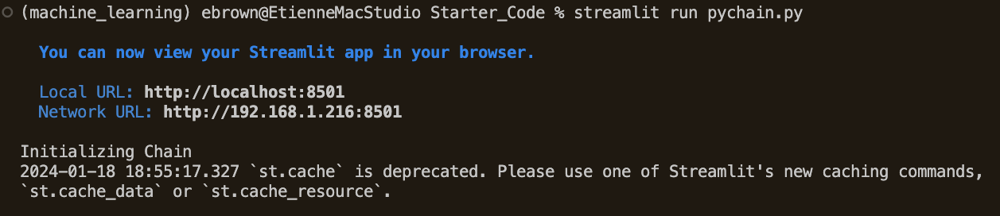
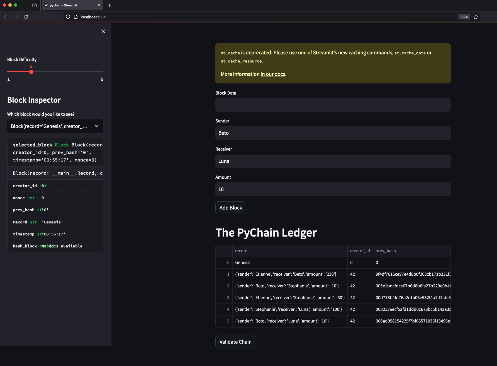
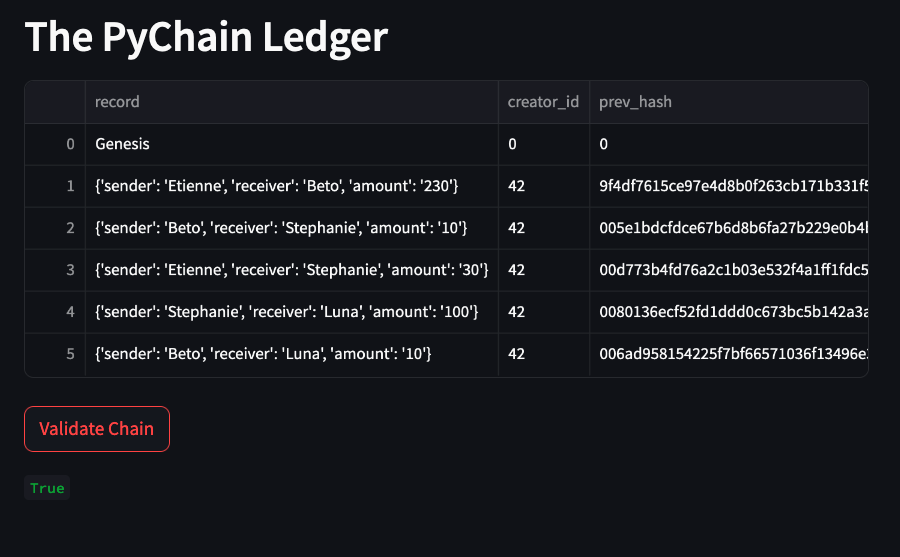
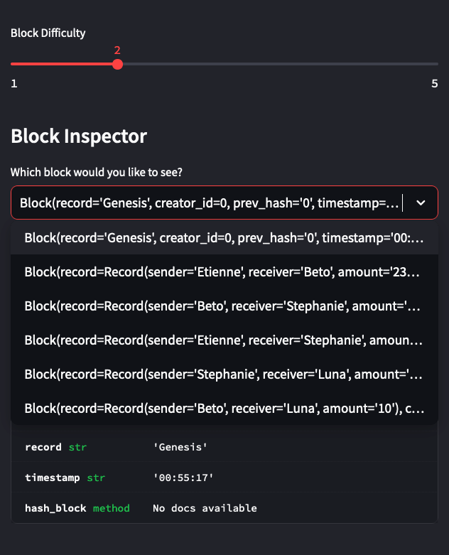

# PyChain Ledger

Code has been created to generate a streamlit page that will assist in establishing a pychain ledger as sender, receiver, and amount data is input by the user. 

The *.py file is run as demonstrated in the image below from the terminal within VSCode.

Below is an example of the streamlit page and established pychain ledger example as run on the local machine.

The PyChain Ledger is validated via a written validation prompt and button. The following image identifies that the chain has been accurately validated.

Further validation can be obtained via the dropdown menu that has been written into code and seen on the left hand side of the screen. The following image identifies this drop down menu and validation can be confirmed as well.

This completes the assignment with written README file identifying and confirming with in use screen shots.